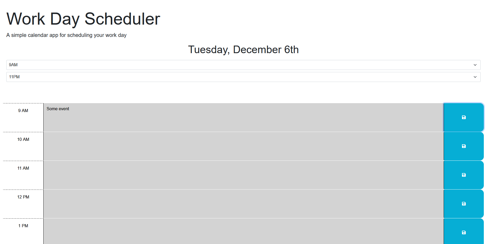

# Work day scheduler 

## Description
This is a simple application that allows users to view a standard work day and add events to each hour. The events are stored to localstorage and are saved on each viewing.  
Users can also select the start and end hours of the day, both of which will be saved to localstorage. The app is built with jQuery, Bootstap, CSS and HTML.  
A link to the deployed application can be found [here](https://lorduswhale.github.io/work-scheduler)

### Screenshot of deployed application

